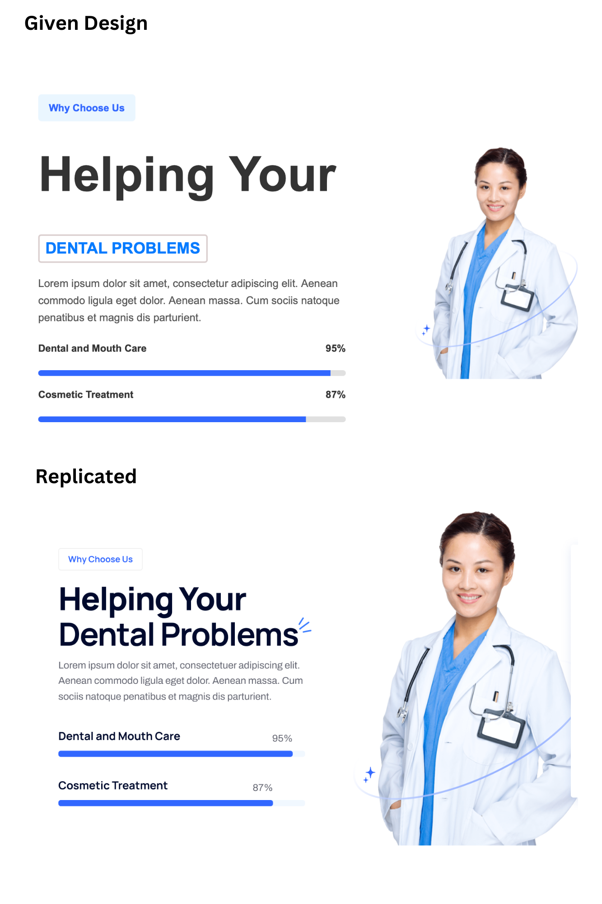
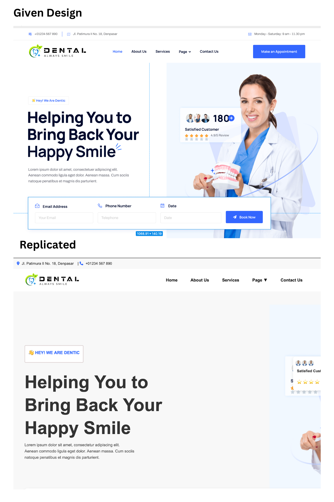
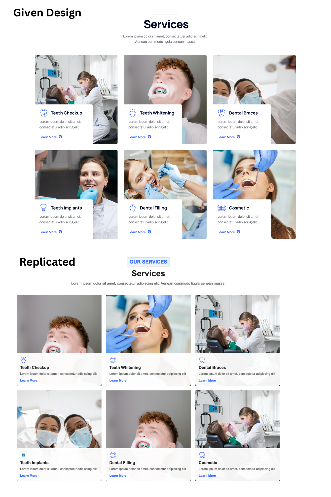

# 🎨 Figma Design Replication

This project is a pixel-perfect replication of a Figma design using HTML, CSS, and JavaScript.

## 🚀 Live Demo
🔗 [View Project](https://www.figma.com/design/Xu32UBv5HhHSJdDJl8Eoqz/dentic?node-id=0-1&t=FiZR846ojEZEBsD1-1) 

## 📷 Screenshots
  
  
  


## ✨ Features
- Fully responsive design 📱💻
- Pixel-perfect implementation 🎯
- Smooth animations & interactions ✨
- Optimized for performance ⚡

## 🛠 Technologies Used
- HTML5 🏗️
- CSS3 🎨 (Flexbox & Grid)
- JavaScript (if applicable) ⚙️
- Bootstrap/Tailwind (if used)

## 🔧 Installation
1. Clone the repository:
   ```sh
   git clone [https://github.com/YOUR-USERNAME/YOUR-REPO.git](https://github.com/Yogeshramu/dentic-website-replication.git)
   
   ```
2. Navigate to the project folder:
   ```sh
   cd project-folder
   ```
3. Open `index.html` in a browser.

## 📜 License
This project is open-source and free to use. 🚀

